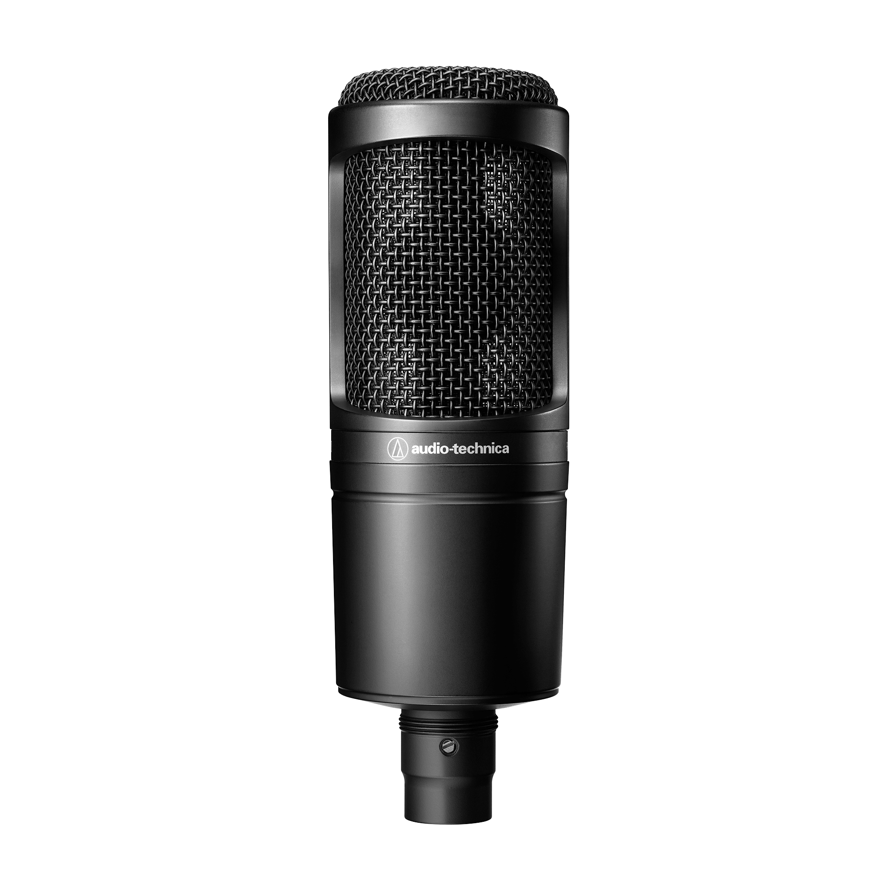
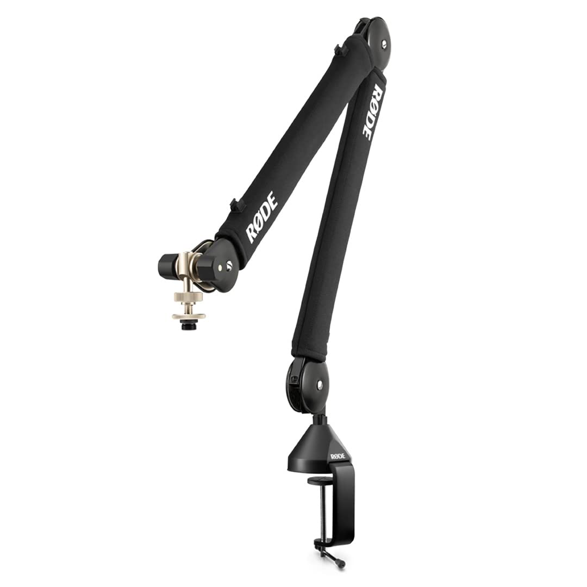
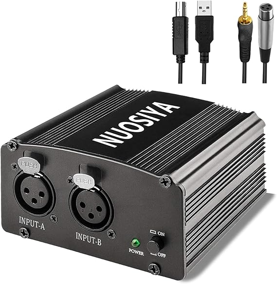

# microphone

<h1>Audio Technica AT2020</h1>

https://www.audio-technica.com/en-gb/at2020?srsltid=AfmBOopTMbO5c9BprayDCk6gmGfHwjAkaKelUCZnNQ0m-cJIKoUMQ6Lv

<h1>Rode PSA1+</h1>

https://rode.com/en/accessories/stands-bars/psa1-plus?variant_sku=PSA1+

<h1>NUOSIYA Phantom Power Supply</h1>

https://www.amazon.co.uk/NUOSIYA-2-channel-Anti-noise-Condenser-Microphone/dp/B08937ZMR7?th=1

<h1>J&D USB C to XLR</h1>

https://www.amazon.co.uk/Microphone-Recording-Dynamic-Braided-Compatible/dp/B0CRR5B356/

